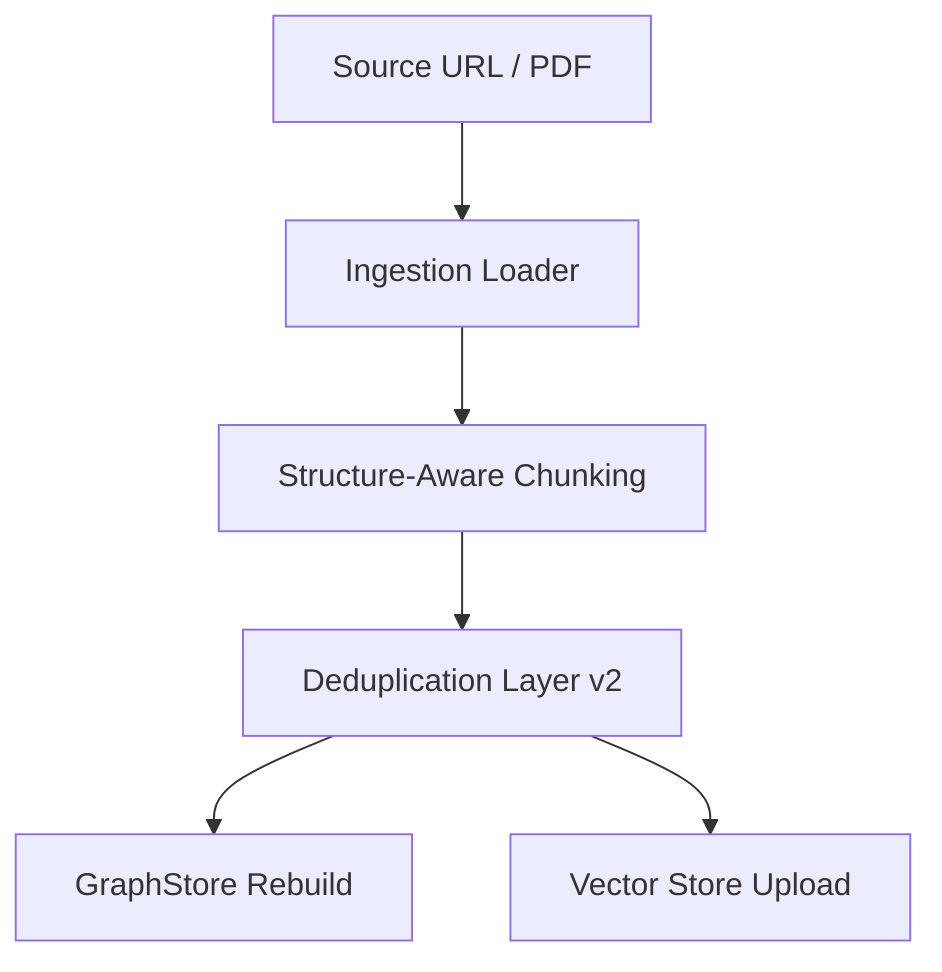
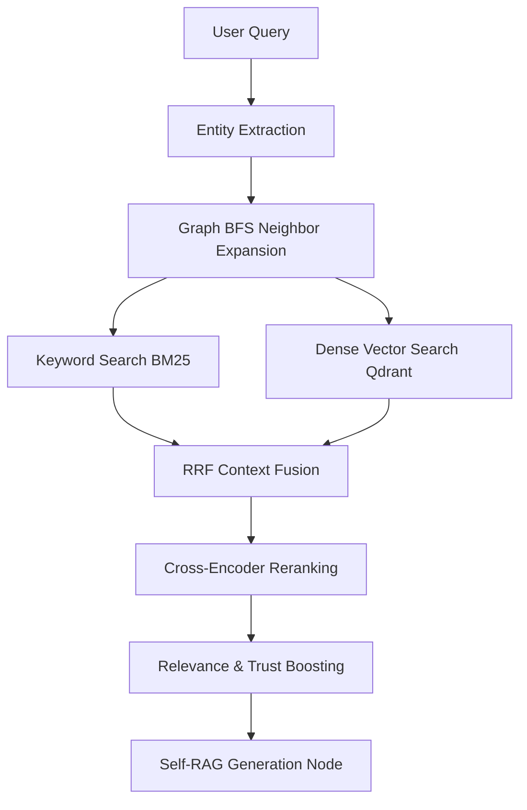

# 📘 System Reference Manual: GraphRAG + RAG Hybrid System & Crawler Pipeline

This manual serves as a comprehensive reference guide for the **Agentic GraphRAG + RAG Hybrid System** and the **VinFast Dynamic Crawler**. It describes the coordination between the user interface (`frontend`), the engine (`src/agentic_rag`), the configuration (`.env.example`), and the architecture guidelines (`guide_RAG`).

---

## 1. Directory Blueprint

```text
Agentic_RAG_Group1/
├── docs/                 # System manuals, handovers, and technical strategies
├── frontend/             # Next.js 15 + React 19 Frontend Web Application
│   ├── app/              # Routing and views (Citation Chat, Dedup Review, etc.)
│   ├── components/       # UI Components (visualizations, tables, markdown renderers)
│   └── lib/              # Client API integrations
├── guide_RAG/            # Phase-by-phase implementation guidelines and specs
│   ├── Crawler_Specs/    # Page-specific crawler specs (Car, Bike, Homepage)
│   ├── PRD_To_Screen/    # System architecture and roadmap checklist (TODO)
│   ├── TCR/              # Indexing details (Ingestion, Graph construction, Communities)
│   └── UI_Pattern/       # Online search methods, Fusion, and Incremental updates
├── src/agentic_rag/      # Core Python engine
│   ├── agent/            # Self-RAG LangGraph orchestrator (nodes, grading, state)
│   ├── ingestion/        # Ingestion loader, chunkers, metadata extraction, deduplication v2
│   ├── integrations/     # Vector stores and third-party RAG services (RAGFlow, pgvector)
│   ├── model_runtime/    # LLM and embedding client adapters
│   └── retrieval/        # Query pipelines, hybrid fusion, boosting, local GraphStore
└── .env.example          # System environment variable configurations
```

---

## 2. Frontend Application Overview

The frontend is a **Next.js 15** web app built to interface with the REST and WebSocket endpoints of the FastAPI Python backend.

### Key Pages & Navigation Paths
- **`[Citation Chat] (/citation-chat)`**: Main chatbot interface supporting conversational memory. Dynamically highlights source documents, pages, and dynamic configuration stats. It links to the dedicated document viewer.
- **`[Deduplication Review] (/internal/dedup-review)`**: An interactive workbench listing duplicate candidates flagged by the backend pipeline. Shows SimHash Hamming distance, exact matches, and LLM-assisted review reasons for auditing.
- **`[Conflict Review] (/internal/conflict-review)`**: Lists conflicting facts or values (e.g. diverging prices for the same variant) extracted from different pages/times, enabling data reconciliation.
- **`[Evaluation Dashboard] (/internal/eval-review & /internal/eval-results)`**: Displays metrics such as Faithfulness, Relevancy, Context Precision, and Context Recall calculated over test datasets.
- **`[System Configuration] (/config)`**: Viewport showing active environment parameters, retrieval weight weights, and model configurations currently active in the backend process.

---

## 3. Python Backend Engine (`src/agentic_rag`)

The backend engine handles the lifecycle of document processing (offline indexing) and query answering (online retrieval).

### Ingestion & Deduplication Pipeline (Offline)



1. **Crawlers & Ingestion loaders (`src/agentic_rag/ingestion/`)**:
   - Downloads document content.
   - For VinFast dynamic pages (configured in `guide_RAG/Crawler_Specs`), it runs browser automation via Playwright/Crawlee to traverse configuration states (model -> variant -> color -> rolling cost province -> installment terms) and capture structured DOM nodes, screen captures, and network API payloads.
2. **Structure-Aware Chunking (`src/agentic_rag/ingestion/chunking/`)**:
   - Parses Markdown blocks and attaches structural attributes such as `structure_block_type`, `structure_block_id`, and `structure_dedupe_hash`.
   - Structural chunks (like specifications tables, product pricing grids) are marked with `structure_aware = True` in metadata for optimized retrieval filtering.
3. **Deduplication Layer v2 (`src/agentic_rag/ingestion/dedup_detect/`)**:
   - **Layer 1 (Exact)**: Drops chunks with identical normalized content hashes.
   - **Layer 2 (Fuzzy SimHash)**: Flags chunks within a threshold Hamming distance.
   - **Layer 3 (Metadata Blocking + LLM Review)**: Group chunks based on attributes (e.g. model, language) and passes similar pairs to a state-guard script. It detects identical state configs vs actual sibling state configurations (e.g. Eco vs Plus models) using deterministic and LLM rules, saving duplicate review metadata in a JSONL DB.
4. **Local GraphStore (`src/agentic_rag/retrieval/graph_store.py`)**:
   - Builds a local undirected adjacency list graph (`storage/local_pdf/graph_store.json`) containing relationship edges between entities extracted from chunk metadata.

### Retrieval & Hybrid Search (Online)



1. **Entity Extraction & BFS Expansion**:
   - The user query is scanned for target entities. If `RETRIEVAL_GRAPH_ENABLED` is `true`, seed entities are expanded via BFS traversal in `GraphStore` up to `RETRIEVAL_GRAPH_HOPS` (hops default is 1) to fetch neighboring entities, creating a robust filter context.
2. **Hybrid Retriever**:
   - Performs parallel BM25 sparse keyword queries and dense vector searches on Qdrant.
   - Filters out debug-only visual chunks using `metadata_prefilter_exclude = True` in the vector database query.
   - Combines results using Reciprocal Rank Fusion (RRF) with weights configured via `FUSION_BM25_WEIGHT` and `FUSION_DENSE_WEIGHT`.
3. **Cross-Encoder Reranking (`src/agentic_rag/retrieval/search.py`)**:
   - Re-evaluates top-K candidates using an in-process Cross-Encoder model.
4. **Metadata Boosting (`src/agentic_rag/retrieval/boosting.py`)**:
   - Adjusts scores based on metadata fields. Boosts values for high-quality components, verified trust sources, and page-specific priorities.
5. **Self-RAG Orchestration (`src/agentic_rag/agent/`)**:
   - Built on LangGraph, routing queries through:
     - `preprocess_node`: Heuristic-based pronoun resolution/decomposition (0 LLM calls for simple queries).
     - `retrieve_node` -> `rerank_node`.
     - `generate_node`: Generates an answer from context.
     - `grade_hallucination_node`: Validates answer grounding against retrieved chunks.
     - `transform_query_node`: Generates query rewrites to loop back if the answer is hallucinatory or no documents are retrieved.

---

## 4. Configuration Reference Blueprint

Environment variables in `.env.example` govern the settings for the hybrid retrieval engine:

### Model & Providers
- `LLM_PROVIDER` / `LLM_MODEL`: Router for Chat/LLM requests (routed via LiteLLM or direct `local` endpoint).
- `EMBEDDING_PROVIDER` / `EMBEDDING_MODEL`: Router for dense embedding vector generation (e.g. `sentence_transformers`, `local`, or Azure/OpenAI).
- `EVIDENCE_PROVIDER`: Selects retrieved evidence source: `mock`, `ragflow`, or `local_pdf` (local RAG path).

### Indexing & Deduplication
- `LOCAL_PDF_STRATEGY`: Parser backend selection (`docling` or `ocr`).
- `INGESTION_DEDUP_ENABLED`: Toggle for upload-time deduplication check.
- `DEDUP_ENABLE_EXACT`, `DEDUP_ENABLE_SIMHASH`, `DEDUP_ENABLE_EMBEDDING`: Toggles for deduplication layers.
- `INGESTION_INTERACTIONS_ENABLED`: Toggle to ingest crawler interaction traces.

### Retrieval & Fusion Options
- `FUSION_METHOD`: Fusion algorithm (typically `rrf`).
- `RERANK_PROVIDER` / `RERANK_MODEL`: Scoring cross-encoder engine (e.g. `sentence_transformers`).
- `RETRIEVAL_BM25_AUGMENT_KEYWORDS`: Appends LLM-extracted keywords to sparse text indexes.
- `RETRIEVAL_QUESTION_INDEX_ENABLED`: Enables vector searching against LLM-extracted questions.
- `METADATA_BOOSTING_ENABLED`: Master toggle for relevance scoring adjustments based on chunk metadata.
- `METADATA_QUALITY_BOOST_ENABLED`, `METADATA_RETRIEVAL_WEIGHT_BOOST_ENABLED`, `METADATA_TRUST_BOOST_ENABLED`: Fine-grained metadata boosting features.
- `RETRIEVAL_EXCLUDE_DEDUP_LAYERS`: Exclude chunks flagged by specific deduplication layers (e.g. `metadata_llm`).

### Graph-Enhanced Retrieval
- `RETRIEVAL_GRAPH_ENABLED`: Toggle Graph-enhanced retrieval query expansion (seeds entities -> GraphStore -> Qdrant pre-filter).
- `RETRIEVAL_GRAPH_HOPS`: Maximum BFS depth layer for neighbor expansion.

### Orchestrator Mode (LangGraph)
- `AGENT_MODE`: If `true`, routes answers through the Self-RAG loop. If `false`, routes answers through the linear pipeline.
- `AGENT_MAX_STEPS`: Max allowed loop counts for query transformations.
- `AGENT_MAX_GENERATE_ATTEMPTS`: Max regeneration cycles if Hallucination checks fail.
