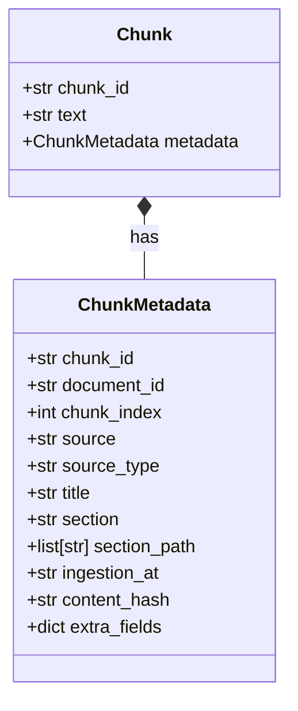

# Unified Metadata Schema for Ingestion Chunks

This document defines the unified metadata schema for document segments (chunks) in the Agentic RAG system. It serves as the single source of truth for all ingestion modules (including PDF, URL, and future document loaders) to ensure consistency in storage, indexing, filtering, and retrieval.

---

## 1. Architecture Overview

To enable unified search and filtering across different document formats, every `Chunk` has a typed `metadata` attribute.



To ensure compatibility with both Pydantic validation and legacy dict-based access, the `ChunkMetadata` schema is implemented as a Pydantic `BaseModel` that implements the standard Python dictionary mapping interface.

---

## 2. ChunkMetadata Schema Definition

The schema is defined in [src/agentic_rag/ingestion/metadata/schema.py](file:///home/natus/Vin_AI_In_Action/VSF_Internship/Agentic_RAG_Group1/src/agentic_rag/ingestion/metadata/schema.py) and exposed via `agentic_rag.ingestion.metadata`.

### 2.1 Shared Base Fields (Emitted by all loaders)

| Category | Field Name | Type | Description |
| :--- | :--- | :--- | :--- |
| **Identity** | `chunk_id` | `str` | Unique, deterministic identifier for the chunk. |
| | `document_id` | `str \| None` | Unique identifier for the parent document. |
| | `chunk_index` | `int` | 1-based global position of this chunk within the document. |
| | `token_count` | `int \| None` | Estimated token count of the chunk text. |
| **Source** | `source` | `str` | Location string (e.g., local file path or URL). |
| | `source_type` | `str` | Loader type: `"pdf"` or `"url"`. |
| **Document** | `title` | `str \| None` | Title of the parent document (extracted from first H1 or metadata). |
| **Structural**| `section` | `str \| None` | Current heading or section name. |
| | `section_level`| `int \| None` | Section heading depth (e.g. `1` for H1, `2` for H2). |
| | `section_path` | `list[str]` | Heading hierarchy from root to current section. |
| **Temporal** | `ingestion_at` | `str` | ISO 8601 UTC processing timestamp. |
| **Semantic** | `content_hash` | `str` | Truncated SHA-256 digest (12 chars) of the chunk text. |

---

### 2.2 Type-Specific Extensions

Loaders add custom metadata fields based on their source type. These are parsed dynamically and stored inside the model's extra fields (`extra="allow"`).

#### URL Ingestion Extensions
* `url` (`str | None`): The source URL.
* `domain` (`str | None`): Extracted domain name for domain-scoped searches.
* `canonical_url` (`str | None`): Document canonical URL.
* `language` (`str | None`): Document language code.
* `page_type` (`str | None`): e.g., `"article"`, `"product"`.
* `is_product` (`bool | None`): True if page corresponds to a product page.

#### PDF Ingestion Extensions
* `file_name` (`str | None`): Name of the source file.
* `page` (`int | None`): Primary page number (1-based) where the chunk starts.
* `pages` (`list[int]`): List of pages containing the chunk content.
* `page_range` (`list[int]`): `[start_page, end_page]` range.
* `parser` (`str | None`): Name of the PDF parser (e.g., `"docling"`).
* `chunking_method` (`str | None`): e.g. `"deterministic"`, `"docling-hybrid"`.
* `asset_ids` (`list[str]`): List of referenced image/table asset IDs.
* `has_image` / `has_table` / `has_chart` (`bool`): Multimodal markers.

---

## 3. Usage & Implementation Guidelines

### 3.1 Instantiation

When constructing a `Chunk`, pass the metadata as a dictionary. Pydantic will validate the dictionary and coerce it into a `ChunkMetadata` object:

```python
from agentic_rag.core.contracts import Chunk

chunk = Chunk(
    chunk_id="pdf_spec_c0001",
    text="Spec sheet content...",
    metadata={
        "chunk_id": "pdf_spec_c0001",
        "source": "data/specs/warranty.pdf",
        "source_type": "pdf",
        "title": "Warranty Policy",
        "chunk_index": 1,
        "ingestion_at": "2026-06-16T12:00:00Z",
        "content_hash": "a1b2c3d4e5f6",
        # loader-specific extra fields:
        "file_name": "warranty.pdf",
        "page": 1,
    }
)

# chunk.metadata is now a validated ChunkMetadata instance:
assert isinstance(chunk.metadata, ChunkMetadata)
```

### 3.2 Dict-like Read and Write

Because `ChunkMetadata` implements the python mapping protocol, you can use standard dictionary syntax for reads, writes, and iterations without code modifications:

```python
# Subscription read
section = chunk.metadata["section"]

# Subscription assignment/update
chunk.metadata["topic_tags"] = ["warranty", "battery"]

# dict.get
title = chunk.metadata.get("title", "Untitled")

# dict.items() and dict.keys()
for key, value in chunk.metadata.items():
    print(f"{key}: {value}")
```

---

## 4. Qdrant Payload Indexing

The following metadata fields are designated as high-priority filter fields and should be indexed in the vector database (`Qdrant` / `pgvector` payload indexes):

* `document_id`
* `source_type`
* `document_type`
* `product_model`
* `language`
* `topic_tags`
* `metadata.deduplication.primary_layer` (for near-duplicate resolution)
